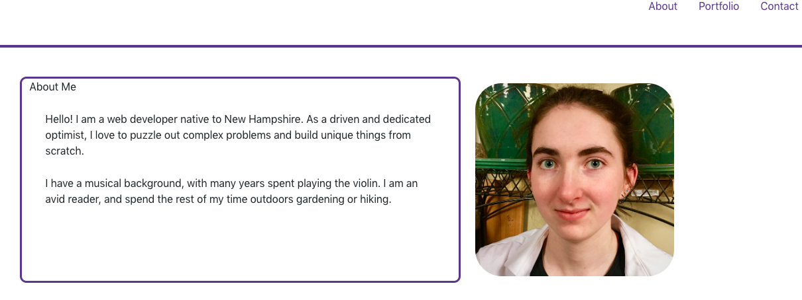
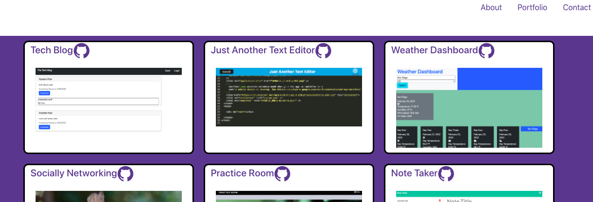

# Reese's React Portfolio

## Table of Contents

- [Pictures](#pictures)
- [Description](#description)
- [License](#license)
- [Installation](#installation)
- [Usage](#usage)

## Pictures
About

Projects

## Description

This is my (Reese's) personal portfolio to display my work using the React JS library.

## License

None

## Installation

The application is publicly available for viewing.

## Usage

The user can navigate using the top links to the about page, the portfolio page, and the contact page. On the portfolio page, the user can click the github icon for any of the projects to view their respetive github repositories, or the title or picture for the deployed application. The bottom icons in the footer link to my LinkedIn, Github, and my resume.

## Deployed Application
https://pasfrad.github.io/React-Portfolio/

## For Questions
Email: rd.hart@outlook.com
